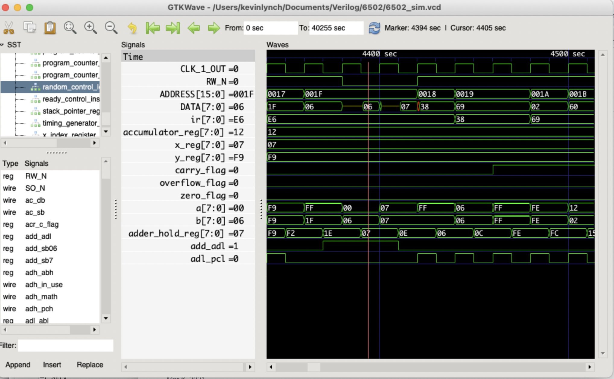

# 6502 Verilog Gate-Level Simulator
> A simulator for the 6502 microprocessor with all internal control signals represented in order to better understand the inner workgings of the 6502.

[![Downloads Stats][npm-downloads]][npm-url]

This is a near gate-level simulator of the 6502 microprocesor with all internal control signals represented.  Most of the control signals come from the random_control_logic block. 

Net numbers used correspond to those used by [Visual6502.org](http://visual6502.org/):
https://github.com/trebonian/visual6502/blob/master/nodenames.js

The organization of the simulator is based on the [Hanson block diagram](https://github.com/klynch71/6502sim/blob/main/Hanson_diagram.png).

This model is not intended for synthesis but rather to learn and observe the actual inner workings of the 6502.

To run the simulator using iverilog:\
  \> iverilog -o dsn -c file_list.txt\
  \> vvp dsn
  
  This will output 6502_sim.vcd which can be observed using GTKWave.
  
  You can change the program that is run by modifying 6502_tb.v.

## Dependencies

A Verilog simulation tool such as [Icarus Verilog](http://iverilog.icarus.com/).\
A waveform viewer such as [GTKWave](http://gtkwave.sourceforge.net/).

## Installation

Note the dependencies above, then simply download this package into a directory.

## Usage example

From within your downloaded directory run:\
   \> iverilog -o dsn -c file_list.txt\
   \> vvp dsn\
Then open the 6502_sim.vcd file with GTKWave.

You can change the program that is run by modifying 6502_tb.v.

If you assemble your own program, you may find the vmem program in the util folder helpful in converting the program's binary output to a verilog memory file.

## Author 
Kevin Lynch

## License

Distributed under the MIT license. 

<!-- Markdown link & img dfn's -->
[npm-image]: https://img.shields.io/npm/v/datadog-metrics.svg?style=flat-square
[npm-url]: https://npmjs.org/package/datadog-metrics
[npm-downloads]: https://img.shields.io/npm/dm/datadog-metrics.svg?style=flat-square
[travis-image]: https://img.shields.io/travis/dbader/node-datadog-metrics/master.svg?style=flat-square
[travis-url]: https://travis-ci.org/dbader/node-datadog-metrics
[wiki]: https://github.com/yourname/yourproject/wiki

